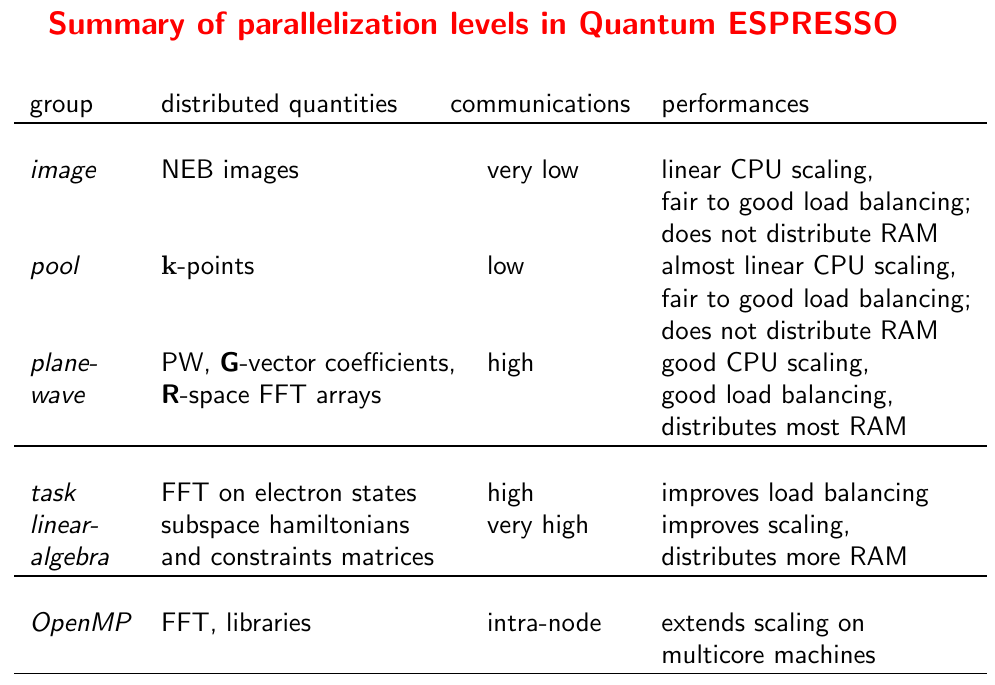

# Bag of Tasks

Since on the levels of image (irreducible representations for q-point) and pool (k-point), the communication cost is low. We can use as many nodes as possible as long as I/O limit is not reached.
>In “image” parallelization, processors can be divided into different “images”, corresponding to one (or more than one) “irrep” or q vectors. Images are loosely coupled: processors communicate between different images only once in a while, so image parallelization is suitable for cheap communication hardware (e.g. Gigabit Ethernet). Image parallelization is activated by specifying the option -nimage N to ph.x. Inside an image, PW and k-point parallelization can be performed. — User’s Guide for Quantum ESPRESSO

The controlling parameters for parallelizing over image and pool are `-nimage` and `-npool`,
```sh
mpirun -np NUMBER_OF_CORES ph.x -nimage NUMBER_OF_NODES -npool 4 ...
```

## Parallelization levels in Quantum ESPRESSO


 (Fig from [Quantum ESPRESSO – Notes on parallel computing](http://training.uhem.itu.edu.tr/docs/18hazirannano/PW-III-para.pdf))

3.3 Parallelization levels, User’s Guide for Quantum ESPRESSO (v.5.3)
- **world**: is the group of all processors (MPI COMM WORLD).
- **images**: Processors can then be divided into different ”images”, each corresponding to a
different self-consistent or linear-response calculation, loosely coupled to others.
- **pools**: each image can be subpartitioned into ”pools”, each taking care of a group of k-points.
- **bands**: each pool is subpartitioned into ”band groups”, each taking care of a group of Kohn-Sham orbitals (also called bands, or wavefunctions) (still experimental)
- **PW**: orbitals in the PW basis set, as well as charges and density in either reciprocal or real space, are distributed across processors. This is usually referred to as ”PW parallelization”. All linear-algebra operations on array of PW / real-space grids are automatically and effectively parallelized. 3D FFT is used to transform electronic wave functions from reciprocal to real space and vice versa. The 3D FFT is parallelized by distributing planes of the 3D grid in real space to processors (in reciprocal space, it is columns of G-vectors that are distributed to processors).
- **tasks**: In order to allow good parallelization of the 3D FFT when the number of processors exceeds the number of FFT planes, FFTs on Kohn-Sham states are redistributed to ”task” groups so that each group can process several wavefunctions at the same time.
- **linear-algebra group**: A further level of parallelization, independent on PW or k-point parallelization, is the parallelization of subspace diagonalization / iterative orthonormalization. Both operations required the diagonalization of arrays whose dimension is the number of Kohn-Sham states (or a small multiple of it).

*Note however that not all parallelization levels are implemented in all codes!*

## Benchmark

|  job | cores( nodes X per cores)|cpu time|wall time|calculation|note|
|------|-------------|---------|--------|---------|-----------|-----|
|1     |  4x24=96   |11h12m    |11h29m    |phonon     |-nimage 8,  |
|2     |  4x24=96   |9h58m     |10h13m    |phonon     |-nimage 4 -npool 3, test 1|
|3     |  8x24=192  |  4h59m   |5h 6m     |phonon     |test2, output=14G|
|4     | 16x24=384  |          |          |phonon     |test3, output=30G|
|4     | 16x24=384  |          |          |phonon     |test3, temp=~/NSCC, output=30G|
|6     | 32x24=768  |          |          |phonon     |test4, output=142G|
|7     | 16x24=384  |          |          |phonon     |test5, output=142G, nq 4x4x3,   Not diagonalizing because representation   74 is not done|
|8     |  4x24=96   |  -       |   -      |phonon  -nimage 4 |wf_collect removed , output=19G|
|9     |  8x24=192  |  3h 3m   | 3h 7m    |phonon  -nimage 16 |test6_no_wf_collect,wf_collect removed , output=25G|
|10    |  32x24=768 | 1h38m    | 1h40m    |phonon  -nimage  32 |test7_no_wf_collect,wf_collect removed , output=48G|
|11    |  48x24=1152| 1h 8m    | 1h 10m   |phonon  -nimage  48 -npool 3               |test8_no_wf_collect,wf_collect removed , output=70G|
|12    |  48x24=1152| 1h 18m   | 1h 20m   |phonon  -nimage  48 -npool 3 -ntg 2 -ndiag 4|test9_no_wf_collect,wf_collect removed , output=70G|


## Non-blocking processes

To run multiple jobs in one job script, the processes have to be started in a non-blocking way. In Renata's bag-of-tasks, this is implemented by using Python's `subprocess` module which allow you to spawn new processes and manage them
>The `subprocess` module allows you to spawn new processes, connect to their input/output/error pipes, and obtain their return codes.  

Another way to implement non-blocking processes natively in shell is to run the processes in the background,
- `jobs -p`
- `program &`

A complete example
```sh
./1.sh &
./2.sh &
jobs -p
wait
#1.sh
#!/bin/bash
echo "I'm #1"
sleep 2
echo "#1 finished"
#2.sh
echo "I'm #2"
sleep 2
echo "#2 finished"
```
### Resources 

[17.1. subprocess — Subprocess management — Python 2.7.11 documentation](https://docs.python.org/2/library/subprocess.html)

[bash - How to get list of all child process spawned by a script - Super User](https://superuser.com/questions/641967/how-to-get-list-of-all-child-process-spawned-by-a-script)

[linux - how to execute programs in non-blocking way from scripts - Stack Overflow](https://stackoverflow.com/questions/6665604/how-to-execute-programs-in-non-blocking-way-from-scripts)

[unix - Bash & blocking processes - Server Fault](https://serverfault.com/questions/101278/bash-blocking-processes)

[job control - Non-blocking bash command - Unix & Linux Stack Exchange](https://unix.stackexchange.com/questions/15985/non-blocking-bash-command)


## Issues


### Threaded MKL

/HOME/nsfc2015_369/bag-of-task/testthread


### pw.x run with a different number of pools

You should make sure ph.x has the same amount of processes per image as pw.x. Otherwise you will have to use `wf_collect=.true.` which will eat a lot of disk space and should be avoided.
     
```
 Error in routine phq_readin (1):
     pw.x run with a different number of pools. Use wf_collect=.true.
```

### yhbatch: error: Batch job submission failed: Node count specification invalid

This may be caused by that the nodes required exceed the limit of maximum nodes you can use.

### input statement requires too much data

This seems to be caused by too many pw.x threads.

yhrun -N 4 -n 96 pw.x -np 96

forrtl: severe (67): input statement requires too much data, unit 99, file /HOME/nsfc2015_369/bag-of-task/output0/_ph0/MgAl2O4.recover24

### pwscf Not diagonalizing because representation xx is not done

Pwscf will not abort due to this. It may crash due to I/O problem. Check the job log to find out the reason.


### file MgAl2O4.wfc not found

>Write to either a parallel file system (found only on expensive machines) or to local disks. In the latter case, check that all processors can access pseudo dir and outdir

It seems `recover=.true.` lead to this probem. Remove `recover=.true.` from ph.in

vimdiff /HOME/nsfc2015_369/Fe7C3/freq/Fe7C3_phon_P0.pbs

[[Pw_forum] Phonons at generic q-point](https://webcache.googleusercontent.com/search?q=cache:oYKkjlp8YF0J:qe-forge.org/pipermail/pw_forum/2008-November/085157.html+&cd=1&hl=en&ct=clnk&lr=lang_en%7Clang_zh-CN&client=ubuntu)
>The alternative is not to use wf_collect=.true. in the pw calculation. 


```
wfcdir 	CHARACTER
Default: 	same as "outdir"

    this directory specifies where to store files generated by
    each processor (*.wfc{N}, *.igk{N}, etc.). Useful for
    machines without a parallel file system: set "wfcdir" to
    a local file system, while "outdir" should be a parallel
    or networkfile system, visible to all processors. Beware:
    in order to restart from interrupted runs, or to perform
    further calculations using the produced data files, you
    may need to copy files to "outdir". Works only for pw.x.
 ```        

 Error in routine phq_readin (1):
     pw.x run with a different number of processors. Use wf_collect=.true.

### invalid number of pools, parent_nproc /= nproc_pool * npool

Modules/mp_pools.f90

```fortran
IF ( MOD( parent_nproc, npool ) /= 0 ) CALL errore( 'mp_start_pools', &
           'invalid number of pools, parent_nproc /= nproc_pool * npool', 1 )  
```

### Error in routine  read_namelists (1):

This is error in specifying the input file for pwSCF.
```
 Reading input from standard input

 %%%%%%%%%%%%%%%%%%%%%%%%%%%%%%%%%%%%%%%%%%%%%%%%%%%%%%%%%%%%%%%%%%%%%%%%%%%%%%
     Error in routine  read_namelists (1):

 %%%%%%%%%%%%%%%%%%%%%%%%%%%%%%%%%%%%%%%%%%%%%%%%%%%%%%%%%%%%%%%%%%%%%%%%%%%%%%
     Error in routine  read_namelists (1):
      reading namelist control
 %%%%%%%%%%%%%%%%%%%%%%%%%%%%%%%%%%%%%%%%%%%%%%%%%%%%%%%%%%%%%%%%%%%%%%%%%%%%%%

     stopping ...

```


```
/opt/software/mpich2-intel/bin/mpirun -np 16 pw.x< MgAl2O4_Pt20_nscc.scf.in
/opt/software/mpich2-intel/bin/mpirun -np 16 ph.x< MgAl2O4_ph_Pt20_nscc.in
```
